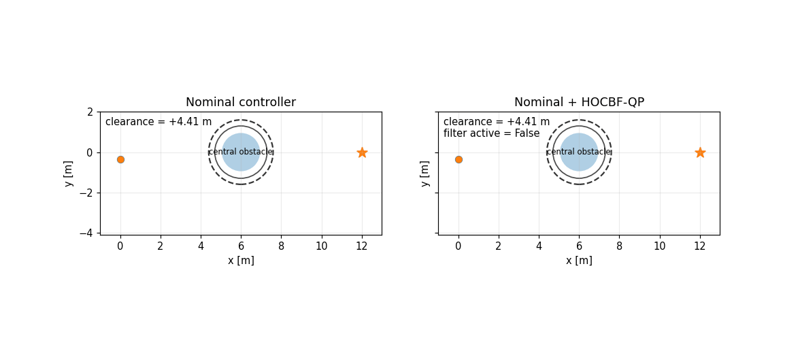
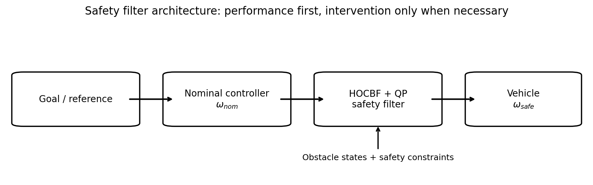
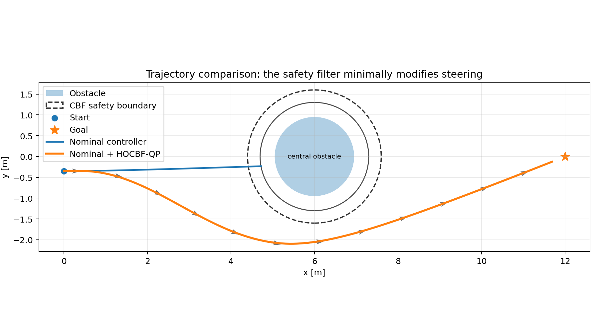
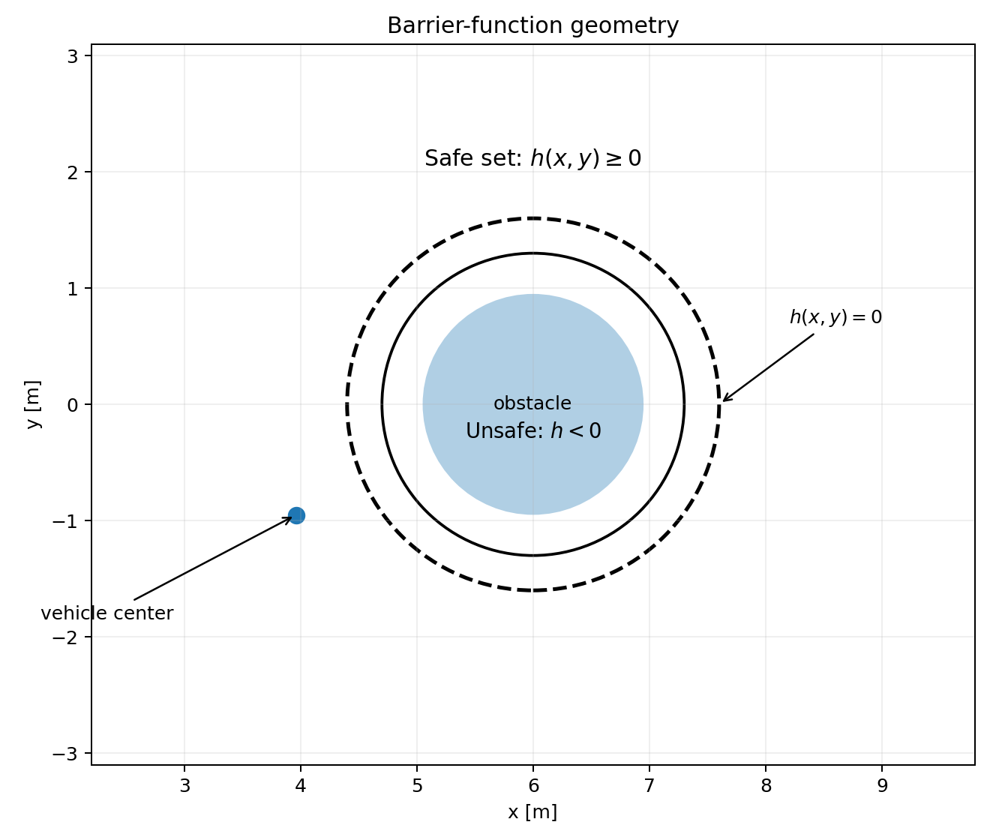
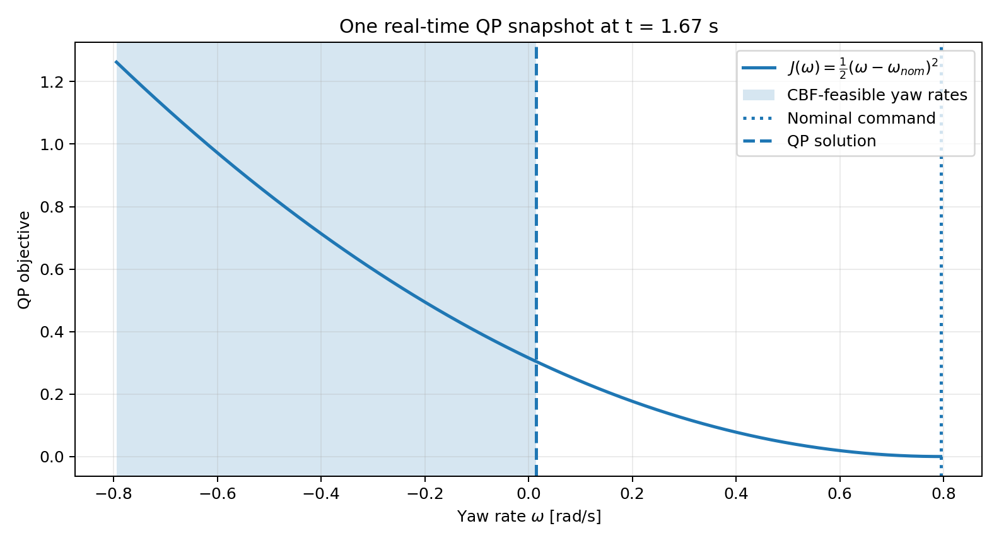
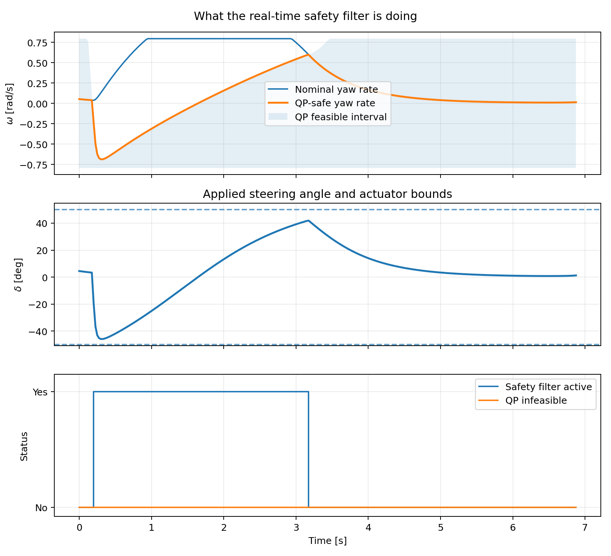
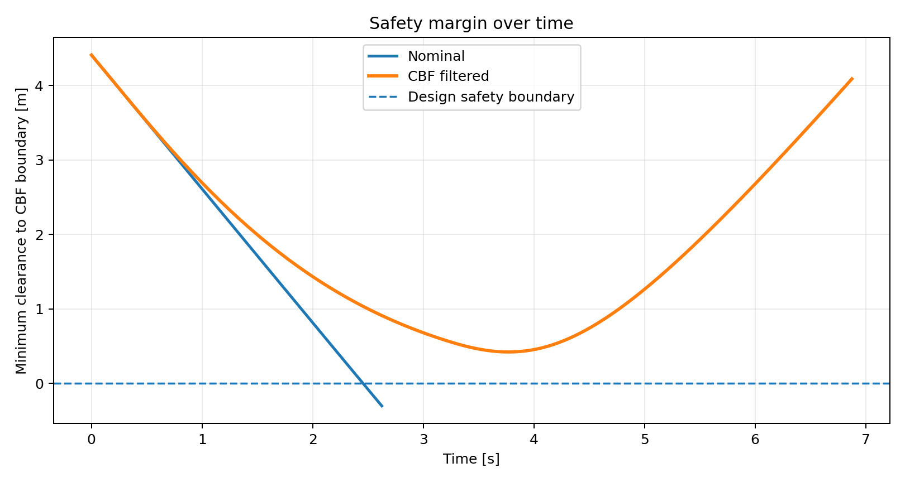

# Control Barrier Functions — A Provably-Safe Steering Filter

<p align="center">
  <b>Wrap an ordinary driving controller with a real-time HOCBF quadratic program that intervenes only when safety requires it.</b>
</p>

<p align="center">
  
</p>

## The pitch

A normal controller is allowed to drive the vehicle toward a goal, even if that controller is imperfect and completely unaware of obstacles. A **Control Barrier Function (CBF) safety filter** sits between that nominal controller and the vehicle. At every control step it solves a tiny quadratic program (QP): stay as close as possible to the nominal steering command while satisfying a mathematical collision-avoidance constraint.

The default demo deliberately uses a naive goal-seeking controller that collides with a circular obstacle. The same controller, wrapped by the HOCBF-QP filter, is smoothly deflected around the obstacle while maintaining the designed safety boundary.

> **Important:** “provably safe” has a precise meaning. The continuous-time HOCBF theorem provides forward-invariance guarantees when its assumptions hold and the QP remains feasible. A sampled numerical simulation is an implementation of that theory, not an unconditional guarantee for a real car with sensing errors, delays, tire slip, model mismatch, or actuator uncertainty. See [Safety guarantee and assumptions](#safety-guarantee-and-assumptions).

---

## Visual overview

<p align="center">
  
</p>

The architecture is intentionally modular:

1. The **nominal controller** decides how it would like to drive.
2. The **HOCBF** converts obstacle geometry into affine safety constraints.
3. The **QP** finds the closest admissible yaw-rate command.
4. The yaw rate is converted to a bicycle-model steering angle and applied to the vehicle.

<p align="center">
  
</p>

---

## 1. Why a safety filter instead of replacing the controller?

A safety filter separates two jobs:

- **Performance:** reach the goal, follow a lane, track a path, or obey a learned policy.
- **Safety:** never enter a forbidden state set, subject to the model and feasibility assumptions.

That separation is useful because the nominal controller can be almost anything: PID, pure pursuit, Stanley, MPC, reinforcement learning, a neural policy, or a human command. The safety layer only asks:

> Is the requested command safe? If not, what is the smallest change that makes it safe?

Mathematically, if the nominal input is \(u_{nom}\), the filter solves

$$
\min_u \; \frac{1}{2}\|u-u_{nom}\|^2
$$

subject to one or more barrier constraints and actuator limits.

When the nominal command is already safe, the optimum is simply \(u=u_{nom}\). The CBF is therefore **minimally invasive**.

---

## 2. Vehicle model

This repository uses a fixed-speed planar kinematic model

$$
\dot{x}=v\cos\psi,
$$

$$
\dot{y}=v\sin\psi,
$$

$$
\dot{\psi}=\omega,
$$

where

- \(x,y\) are the vehicle-center coordinates,
- \(\psi\) is heading,
- \(v>0\) is a fixed longitudinal speed,
- \(\omega\) is yaw rate and is the QP decision variable.

To interpret \(\omega\) as a steering command for a kinematic bicycle with wheelbase \(L\),

$$
\omega = \frac{v}{L}\tan\delta,
$$

therefore

$$
\delta = \tan^{-1}\left(\frac{L\omega}{v}\right).
$$

The steering limit \(|\delta|\leq\delta_{max}\) becomes the yaw-rate limit

$$
|\omega| \leq \omega_{max}
= \frac{v}{L}\tan\delta_{max}.
$$

The simulator integrates the constant-yaw-rate motion exactly over each zero-order-hold timestep.

---

## 3. Defining the safe set

For a circular obstacle centered at \((x_o,y_o)\), define a conservative radius

$$
R = r_{obs}+r_{vehicle}+r_{margin}.
$$

The barrier function is

$$
h(x,y)=(x-x_o)^2+(y-y_o)^2-R^2.
$$

This divides the state space into

$$
\mathcal C = \{(x,y):h(x,y)\geq0\}
$$

and the unsafe region

$$
\mathcal U = \{(x,y):h(x,y)<0\}.
$$

<p align="center">
  
</p>

The sign is intuitive:

- \(h>0\): outside the safety boundary,
- \(h=0\): exactly on the boundary,
- \(h<0\): inside the forbidden set.

The repository also reports **clearance**

$$
d_{clear}=\sqrt{(x-x_o)^2+(y-y_o)^2}-R,
$$

because it is easier to interpret visually in meters.

---

## 4. Why an ordinary first-order CBF is not enough here

For a relative-degree-one constraint, a common zeroing-CBF condition is

$$
\dot h + \alpha(h) \ge 0.
$$

But with a position-only obstacle function and steering/yaw rate as the input, differentiating \(h\) once gives

$$
\dot h = 2v\left[(x-x_o)\cos\psi+(y-y_o)\sin\psi\right].
$$

Notice that \(\omega\) does **not** appear. Steering first changes heading, and heading then changes the future position. The obstacle constraint therefore has relative degree two with respect to yaw rate.

That is why this project uses a **second-order High-Order Control Barrier Function (HOCBF)**.

---

## 5. Deriving the second-order HOCBF

For compactness define

$$
\Delta x=x-x_o,\qquad \Delta y=y-y_o.
$$

The barrier is

$$
h=\Delta x^2+\Delta y^2-R^2.
$$

Its first derivative is

$$
\dot h=2v(\Delta x\cos\psi+\Delta y\sin\psi).
$$

Define

$$
p=-\Delta x\sin\psi+\Delta y\cos\psi.
$$

Differentiating again gives

$$
\ddot h = 2v^2+2vp\omega.
$$

Now introduce two positive gains \(k_1,k_2>0\). The first auxiliary barrier quantity is

$$
\psi_1 = \dot h + k_1 h.
$$

The second-order HOCBF condition is

$$
\dot\psi_1+k_2\psi_1\ge0.
$$

Expanding it yields

$$
\ddot h + (k_1+k_2)\dot h+k_1k_2h\ge0.
$$

Substituting \(\ddot h\) gives

$$
2vp\omega
+
2v^2
+
(k_1+k_2)\dot h
+
k_1k_2h
\ge0.
$$

This can be written as the affine control constraint

$$
a(x)\omega+b(x)\ge0,
$$

with

$$
a(x)=2vp,
$$

and

$$
b(x)=2v^2+(k_1+k_2)\dot h+k_1k_2h.
$$

That affine form is the key reason the method is convenient for real-time optimization.

---

## 6. The real-time quadratic program

At every simulation step, the nominal controller proposes \(\omega_{nom}\). The safety filter solves

$$
\begin{aligned}
\omega^* = \arg\min_{\omega}\quad
&\frac{1}{2}(\omega-\omega_{nom})^2\\
\text{subject to}\quad
&a_i(x)\omega+b_i(x)\ge0,\qquad i=1,\dots,N,\\
&-\omega_{max}\le\omega\le\omega_{max}.
\end{aligned}
$$

There is one CBF inequality per obstacle.

Because this demo has only **one scalar decision variable**, each affine inequality trims the allowable yaw rates to an interval. The exact QP solution is therefore the Euclidean projection of \(\omega_{nom}\) onto the intersection of all feasible intervals. The implementation solves this analytically, which is mathematically equivalent to sending this one-dimensional problem to a generic QP solver but is dramatically easier to inspect.

<p align="center">
  
</p>

The figure shows a typical active-filter instant:

- the parabola is the QP cost,
- the vertical dotted line is the nominal command,
- the shaded interval contains commands satisfying the CBF and actuator constraints,
- the dashed line is the closest feasible command selected by the QP.

---

## 7. What happens at every timestep

Conceptually the code executes

```python
state = measure_state()
omega_nom = nominal_controller(state, goal)
constraints = build_hocbf_constraints(state, obstacles)
omega_safe = solve_qp(omega_nom, constraints, actuator_limits)
vehicle.step(omega_safe)
```

The QP is dormant whenever the nominal command already lies inside the feasible interval. It becomes active only when the nominal command would violate a safety constraint.

<p align="center">
  
</p>

The three panels show:

1. nominal versus applied yaw rate and the instantaneous QP-feasible interval,
2. the equivalent steering angle and actuator limits,
3. when the safety filter is active and whether the QP is feasible.

---

## 8. The safety result

A trajectory plot can look convincing while still hiding a safety violation. The repository therefore plots the minimum distance to the designed CBF boundary throughout the run.

<p align="center">
  
</p>

The horizontal zero line is the safety boundary:

$$
d_{clear}=0.
$$

The nominal controller crosses it and eventually physically collides with the obstacle. The filtered controller stays on the safe side in the default scenario.

This diagnostic is as important as the animation: it converts “the path looks safe” into a quantitative safety trace.

### Default-scenario numerical result

With the repository's checked-in `straight` configuration:

| Metric | Nominal controller | HOCBF-QP filtered |
|---|---:|---:|
| Physical collision | **Yes** | **No** |
| Minimum clearance to designed CBF boundary | -0.302 m | +0.422 m |
| Hard QP feasible at every sampled step | N/A | **Yes** |
| Fraction of sampled steps with safety intervention | 0% | 43.1% |

The values above are reproducible by running `python demo.py --scenario straight`. They are demonstration results for the included model and parameters, not a universal performance claim.

---

## 9. Nominal controller

The nominal controller is intentionally simple and obstacle-blind. It points the vehicle toward the goal:

$$
\psi_d=\operatorname{atan2}(y_g-y,x_g-x),
$$

$$
e_\psi=\operatorname{wrap}(\psi_d-\psi),
$$

$$
\omega_{nom}=\operatorname{sat}(k_\psi e_\psi,\,-\omega_{max},\omega_{max}).
$$

This is not presented as a high-performance autonomous-driving controller. It is deliberately imperfect so the effect of the safety wrapper is obvious.

A major point of the project is that the CBF layer can later wrap a better controller without changing the safety-filter architecture.

---

## 10. Safety guarantee and assumptions

The theoretical idea behind a CBF/HOCBF is **forward invariance**. Informally, if the system begins in the appropriate safe set and the barrier inequalities remain satisfied, the closed-loop trajectory cannot leave that set.

For this second-order construction, one tracks both the original barrier and the auxiliary condition

$$
\psi_1=\dot h+k_1h.
$$

The corresponding sets can be written as

$$
\mathcal C_0=\{x:h(x)\ge0\},
$$

$$
\mathcal C_1=\{x:\psi_1(x)\ge0\}.
$$

Under the standard HOCBF assumptions, an initial state in the required intersection, and a feasible admissible control satisfying the HOCBF inequality, the intersection \(\mathcal C_0\cap\mathcal C_1\) is forward invariant.

### The guarantee is conditional

The phrase “provably safe” does **not** mean that this Python demo can certify an arbitrary physical car. The guarantee depends on assumptions including:

- the mathematical model adequately representing the plant,
- correct obstacle positions and radii,
- appropriate initial barrier conditions,
- the HOCBF-QP remaining feasible,
- the actuator being capable of applying the requested command,
- continuous-time enforcement in the underlying theorem.

A digital controller only checks constraints at discrete instants. Very large sampling periods can allow inter-sample violations even when all sampled points look valid. Real systems also introduce sensor noise, delays, unmodeled dynamics, tire saturation, disturbances, and actuator rate limits. Robust CBFs and sampled-data CBF methods are natural extensions when those effects matter.

The code explicitly records QP feasibility so that a failed assumption is visible rather than silently hidden.

---

## 11. Repository structure

```text
CBF-Safe-Steering-Filter/
├── assets/
│   └── generated/
│       ├── architecture.png
│       ├── straight_demo.gif
│       ├── straight_trajectory.png
│       ├── straight_safety_margin.png
│       ├── straight_control_activity.png
│       ├── straight_qp_snapshot.png
│       └── straight_barrier_geometry.png
├── scripts/
│   └── generate_assets.py
├── src/
│   └── cbf_safe_steering/
│       ├── __init__.py
│       ├── cbf.py
│       ├── cli.py
│       ├── controllers.py
│       ├── models.py
│       ├── qp.py
│       ├── scenarios.py
│       ├── simulation.py
│       ├── utils.py
│       └── visualization.py
├── tests/
│   ├── test_cbf.py
│   ├── test_qp.py
│   └── test_simulation.py
├── demo.py
├── pyproject.toml
├── requirements.txt
├── REFERENCES.bib
├── REPOSITORY_INFO.md
├── LICENSE
└── README.md
```

---

## 12. Installation

### Option A — editable install

```bash
git clone https://github.com/Saeedam02/CBF-Safe-Steering-Filter.git
cd CBF-Safe-Steering-Filter
python -m pip install -e ".[dev]"
```

### Option B — requirements file

```bash
python -m pip install -r requirements.txt
```

Python 3.10+ is recommended.

---

## 13. Run the demo

After an editable install:

```bash
cbf-steering-demo --scenario straight
```

or directly:

```bash
python demo.py --scenario straight
```

The command prints a short numerical summary and generates the plots/GIF in `assets/generated/`.

Available scenarios:

```bash
python demo.py --scenario straight
python demo.py --scenario slalom
python demo.py --scenario narrow-gate
```

Skip GIF generation when iterating quickly:

```bash
python demo.py --scenario straight --no-animation
```

Choose another output directory:

```bash
python demo.py --scenario slalom --output results/slalom
```

---

## 14. Run the tests

```bash
pytest
```

The tests verify, among other things:

- the barrier sign inside and outside the safe set,
- the analytic first derivative against a finite-difference check,
- exact scalar-QP projection behavior,
- infeasibility detection,
- steering saturation,
- the default nominal controller colliding,
- the HOCBF-filtered controller avoiding physical collision,
- the safety filter actually becoming active.

---

## 15. Tuning the filter

The important parameters live in `scenarios.py`.

### Safety margin

```python
HOCBFConfig(safety_margin=0.30)
```

Larger values inflate the obstacle earlier. They are conservative but can also make the QP infeasible in tight spaces.

### Barrier gains

```python
HOCBFConfig(k1=1.0, k2=1.5)
```

The gains shape how strongly the higher-order barrier reacts to motion toward the boundary. They should not be interpreted as arbitrary “aggressiveness knobs” independently of feasibility and initial conditions; changing them changes the admissible control set.

### Steering authority

```python
VehicleParams(max_steer=math.radians(50))
```

A safety filter cannot create actuator authority that the vehicle does not possess. If the vehicle approaches too quickly with insufficient steering authority, the hard CBF constraints can become infeasible.

### Sampling period

```python
dt = 0.025
```

Smaller timesteps make the sampled simulation more closely approximate continuous enforcement, at the cost of more QP evaluations.

---

## 16. Multiple obstacles

For \(N\) obstacles, the QP simply receives \(N\) inequalities:

$$
a_i(x)\omega+b_i(x)\ge0,
\qquad i=1,\dots,N.
$$

Because \(\omega\) is scalar, every obstacle contributes either a lower or upper bound on allowable yaw rate. The solver intersects all of them with the physical actuator interval.

The `slalom` scenario demonstrates repeated interventions from multiple obstacles.

---

## 17. QP infeasibility is meaningful

A hard safety QP can be infeasible. That is not necessarily a software bug; it can mean the vehicle has entered a state from which the available steering authority cannot satisfy all requested safety constraints.

For example, conflicts can occur when:

- speed is too high,
- steering angle is too limited,
- the obstacle is detected too late,
- margins are too conservative,
- two obstacle constraints demand incompatible turns.

The implementation reports infeasibility instead of secretly adding safety slack. In an actual safety architecture one might combine braking, steering, predictive safety constraints, robust margins, or a supervisory emergency mode.

---

## 18. Why solve the QP analytically?

A generic QP package would solve this problem correctly, but the core demo has only one decision variable. The exact feasible set is an interval and the optimum has a closed-form geometric interpretation:

$$
\omega^*=\Pi_{\Omega_{safe}}(\omega_{nom}),
$$

where \(\Pi\) denotes Euclidean projection and \(\Omega_{safe}\) is the intersection of the HOCBF and actuator constraints.

That makes the repository easier to learn from:

- no opaque optimization dependency,
- the feasible set can be visualized directly,
- every QP decision can be inspected,
- the implementation is extremely fast.

If longitudinal acceleration, steering rate, or several independent control inputs are introduced, switching to a general QP solver such as OSQP or another convex optimizer becomes natural.

---

## 19. Extensions

Good next steps for this project include:

1. **Joint braking + steering QP** — optimize acceleration and yaw rate together.
2. **Moving obstacles** — include obstacle velocity in the barrier derivatives.
3. **Lane boundaries** — add left/right lane CBF constraints.
4. **Pure-pursuit or Stanley nominal controller** — show that the safety wrapper is controller-agnostic.
5. **MPC + CBF** — use MPC for performance and CBFs as hard safety constraints.
6. **Robust CBFs** — account explicitly for bounded state-estimation and model errors.
7. **Sampled-data safety** — enforce inter-sample safety rather than relying on a small timestep.
8. **Dynamic bicycle model** — incorporate lateral velocity, yaw dynamics, and tire-force limits.
9. **Actuator rate constraints** — make steering angle/rate part of the state and use an appropriate higher-order barrier.
10. **Hardware-in-the-loop** — stream states from a simulator and solve the safety QP online.

---

## 20. References

The implementation is educational and follows the core theory developed in the CBF literature:

1. A. D. Ames, X. Xu, J. W. Grizzle, and P. Tabuada, **“Control Barrier Function Based Quadratic Programs for Safety Critical Systems,”** *IEEE Transactions on Automatic Control*, 62(8), 2017. Preprint: https://arxiv.org/abs/1609.06408
2. W. Xiao and C. Belta, **“Control Barrier Functions for Systems with High Relative Degree,”** *IEEE Conference on Decision and Control (CDC)*, 2019. Preprint: https://arxiv.org/abs/1903.04706

These references are strongly recommended if you want the formal definitions of forward invariance, class-\(\mathcal K\) functions, relative degree, and HOCBF conditions.

---

## License

MIT License. See [`LICENSE`](LICENSE).

## Communication & Interaction

Questions, feedback, bug reports, or ideas for extending this are welcome
— especially anything pushing toward the "Ideas for extending it" list
above.

- **Open an issue** on this repo for bugs, questions, or feature requests
- **Pull requests** are welcome
- **Email**: saeedaghamohammadi99@gmail.com — for collaboration or research-related questions

If this project was useful or interesting, a star on the repo is always
appreciated.

